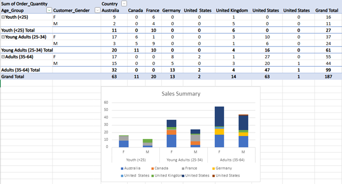
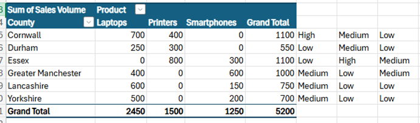
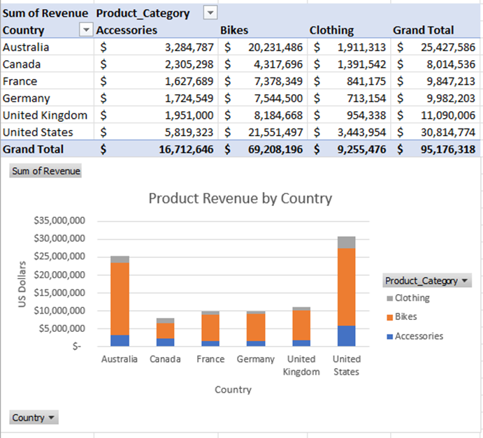
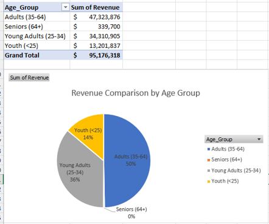

# Excel-Projects
# 📊 Data Technician Workbook – Week 1

Welcome to my Week 1 workbook submission for the Data Technician course. This workbook includes foundational tasks and exercises in data handling, spreadsheet functions, pivot tables, and basic data legislation knowledge. It reflects hands-on work with datasets using Microsoft Excel.

## 🗂️ Contents Overview

### ✅ Day 1 – Data Laws and Regulations
- Summary of key UK and EU laws for data handling:
  - **Data Protection Act**
  - **GDPR**
  - **Freedom of Information Act**
  - **Computer Misuse Act**
- For each, covered:
  - Purpose and importance
  - Real-world examples
  - Potential consequences of non-compliance

### 📈 Day 2 – Excel Fundamentals
- Worked with `retail_sales_dataset.xlsx`:
  - Created Excel tables from raw data
  - Applied filters (e.g., sort Age descending)
  - Used key functions:
    - `SUM` to calculate commission totals
    - `AVERAGE` to find average commission

### 🔍 Day 3 – Pivot Tables & Data Insights
- **Task 1: Bike Sales Lab**
  - Created Pivot Tables to analyze sales across markets, age groups, and genders
  - Key insights:
    - Australia is the most profitable country
    - Adults and females lead in sales performance

- **Task 2: Sales Performance by County**
  - Built Pivot Tables summarizing sales by county and product
  - Used the `SWITCH` function to categorize sales volumes:
    - High (>600), Medium (300–600), Low (<300)

- **Task 3: Data Visualizations**
  - Hands-on work with chart creation and visualization using `Day_3_Task_3_Bike_Sales_Visualisations_Lab.xlsx`
  - Explored how visuals enhance storytelling with data

## 📌 Notes
- Print screen evidence and formula demonstrations are embedded within the workbook
- Some lab files referenced for practice were external downloads
- This submission reflects hands-on practice with Excel tools, functions, and principles for working with data responsibly
